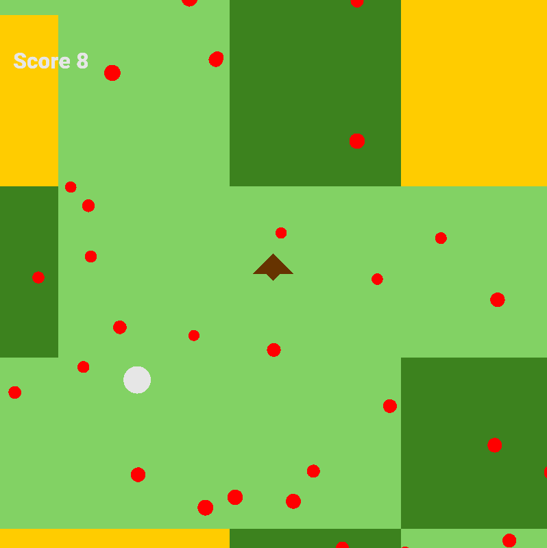

# Colubris Game Engine

Colubris is a simple 2D game engine written from scratch in OpenGL, with the help of FreeType library, which supports, among other features:
- a hierarchy tree of objects,
- a component-based system for custom object behaviour,
- 2D rendering of objects composed of polygons and circles,
- text rendering,
- collision detection of polygon colliders,
- user input detection (keyboard),
- grouping and ordering objects in layers.

Libraries used:
- GLFW,
- GLAD,
- GLM,
- FreeType 2.

## Setup

To setup the working environment, clone the repository, install the freetype2 library, then configure and build the project using CMake.

## Documentation
### Table of contents
Basic concepts:
- [`GameObject`](src/gameobject/gameobject.md)
- [`Component`](src/component/component.md)
- [`Transform`](src/transform/transform.md)
- [`SceneManager`](src/scene_manager/scene_manager.md)
- [Scripts](src/scripts/scripts.md)
- [`Time`](src/time/time.md)
- [`Input`](src/input/input.md)

Intermediate concepts:
- [`Renderer`](src/renderer/renderer.md)
- [`Mesh`](src/mesh/mesh.md)
- [`Text`](src/text/text.md)
- [`Collider`](src/colliders/collider.md)

Advanced concepts:
- [Layers](src/layers/layers.md)
- [`Shader`](src/shaders/shader.md)

Utilities:
- [`math`](src/math/math.md)
- [`Random`](src/random/random.md)

Example scenes:
- [*Shoot the triangle*](src/scripts/v1.1-example-01/example.md)
  
- [*Sheep herder*](src/scripts/v1.1-example-02/example.md)
  

Additional insights:
- [`HierarchyTree`](src/hierarchy_tree/hierarchy_tree.md)

## License

This project is under MIT License.
