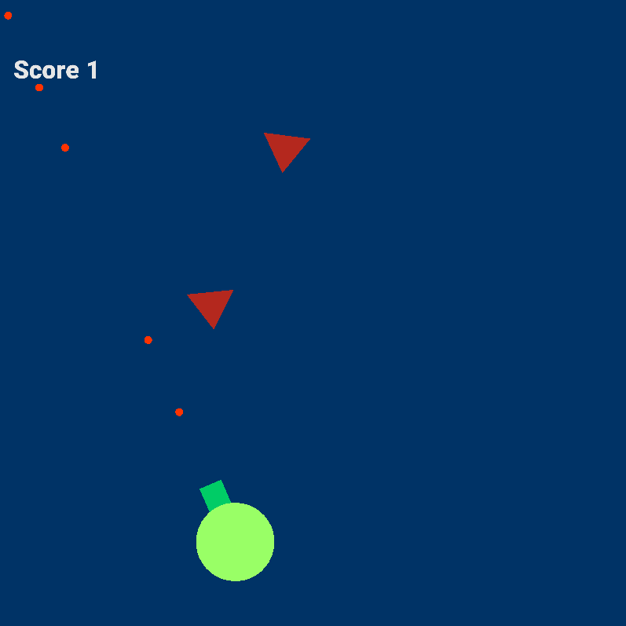
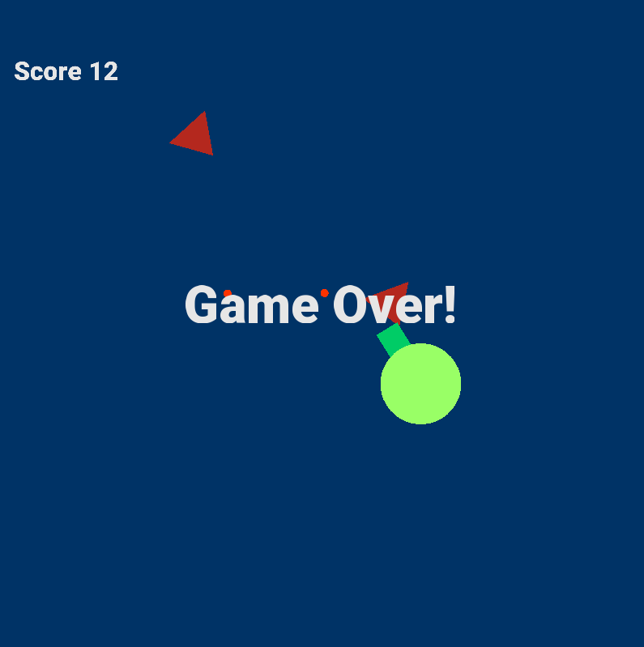

# v1.1 example scene 01
## *Shoot the triangle*
An example scene showing basic funcitonality of the engine after the rendering update.

### Overview
A simple projectile shooter with keyboard user input, collision detection, and text rendering.

### Goal
Shoot down as many enemies as possible without getting touched by them.

### Controls
Player movement:
- position: up/down, left/right arrows,
- rotation: e - clockwise, w - counterclockwise.

Shooting:
- space bar.

