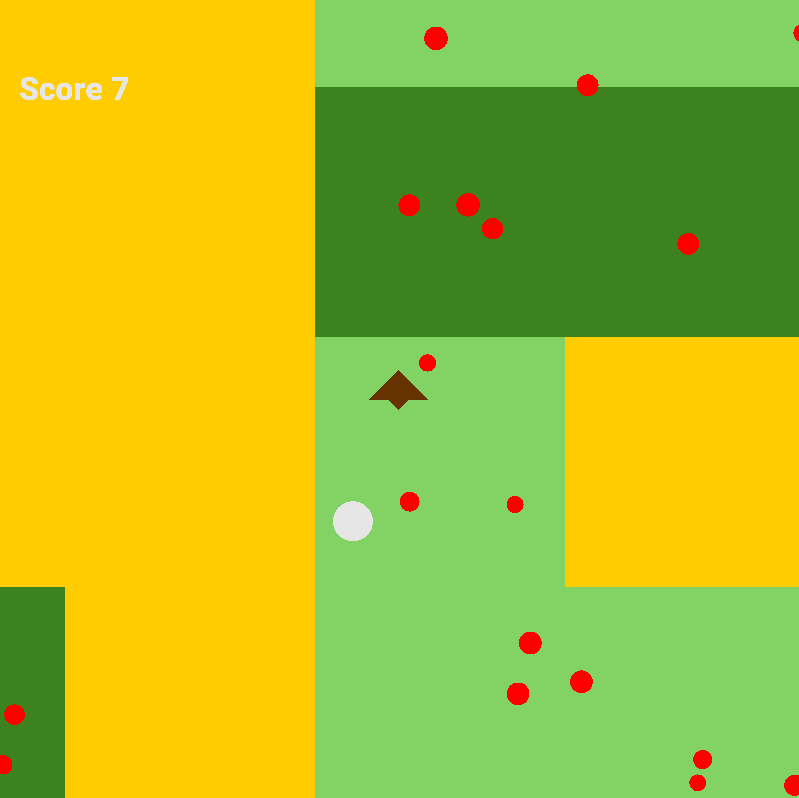

# v1.1 example scene 02
## *Sheep herder*
An example scene showing basic functionality of the engine after the rendering update.

### Overview
An exploration of the concept of layers as chunks. The player moves through a large pseudo-randomly generated map activating adjecent chunks while guiding a sheep and feeding it with flowers.

### Controls
Arrow keys for moving the player.

### Additional notes
Currently quite a lot of code is needed to emulate the moving camera, since no Camera component exists yet. However, that is expected to change with the next update of the engine.